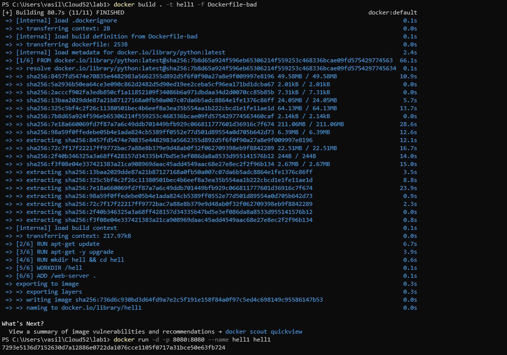
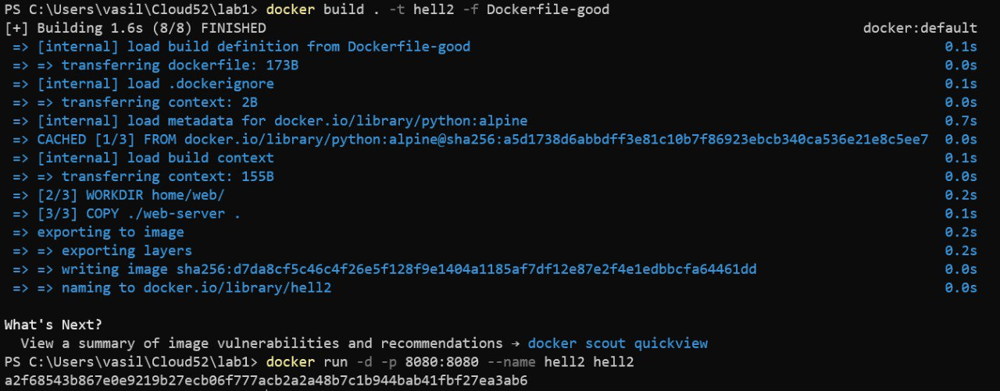
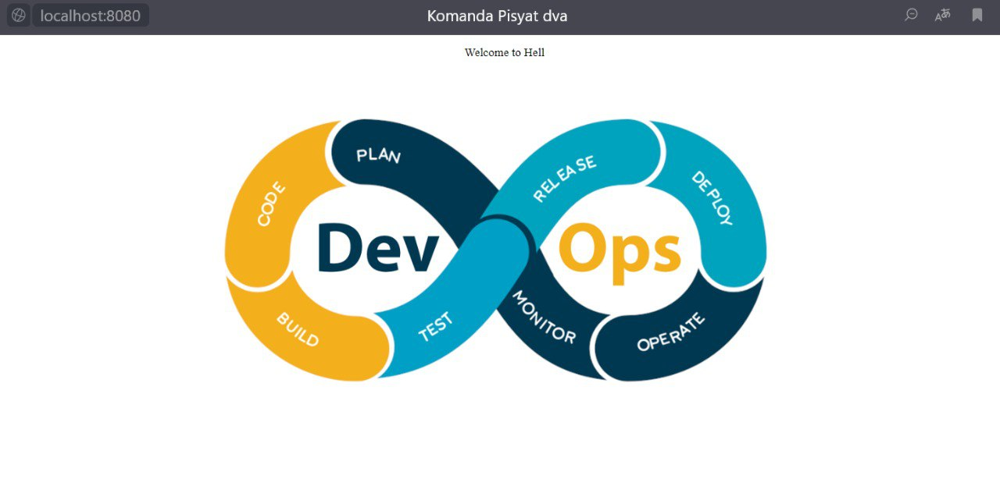

# Лабораторная работа №1 

### Команда  
- Кунгурова Василиса К34201  
- Кормщикова Варвара К34201  

### Задание
Написать два Dockerfile – плохой и хороший. Плохой должен запускаться и работать корректно, но в нём должно быть не менее 3 “bad practices”. В хорошем Dockerfile они должны быть исправлены. В Readme описать все плохие практики из кода Dockerfile и почему они плохие, как они были исправлены в хорошем Dockerfile, а также две плохие практики по использованию этого контейнера. 
# Dockerfile_bad
Для начала был создан файл Dockerfile_bad, он запускается и работает, однако в нём используются следующие "плохие" практики. Разберем каждую из них:

1. Использование тега "latest" для указания версии образа в Dockerfile не рекомендуется, поскольку это может привести к конфликтам версий при последующих запусках из-за постоянного обновления версий. Вместо этого следует фиксировать конкретную версию образа.
```
FROM python:latest
```

2. Неэффективное использование слоев: Команда ```RUN mkdir hell && cd hell``` создает новый слой в образе Docker. Последующая команда ```WORKDIR /hell``` создает еще один слой. Это неэффективно, так как можнно минимизировать количество слоев, не используя ненужные команды
```
RUN mkdir hell && cd hell
WORKDIR /hell
```

3. Установка ненужных пакетов в Docker-образ ведет к добавлению избыточных файлов и зависимостей, что, в свою очередь, увеличивает размер конечного образа. Каждый установленный пакет расширяет образ, добавляя дополнительные элементы.
```
RUN apt-get update
RUN apt-get -y upgrade
```

4. Разделяя инструкции ```ENTRYPOINT``` и ```CMD``` в Dockerfile, можно столкнуться с некоторыми ограничениями и проблемами. ```ENTRYPOINT``` задан как ["python3"], а ```CMD``` как ["server.py"]. Вместе они определяют команду запуска контейнера как python3 server.py. Для лучшего использования, разделенные команды следует объеденить в одну.
```
ENTRYPOINT ["python3"]
CMD ["server.py"]
```
#### Запуск Dockerfile_bad


# Dockerfile_good
В хорошем файле были исправлены все bad practices и решение стало качественнее
```
FROM python:alpine

LABEL version="good"

WORKDIR home/web/
COPY ./web-server .

ENTRYPOINT ["python3", "server.py"]
EXPOSE 8080
```
#### Запуск Dockerfile_good

#### Запуск web-сервиса


### Вывод
В ходе выполнения этой лабораторной работы был проведен анализ и сравнение "хороших" и "плохих" методик создания и запуска Dockerfile. На практике были разработаны два отдельных файла: один, демонстрирующий "плохие" практики, включающие такие элементы как излишняя многослойность, использование нефиксированных версий образов и установка ненужных пакетов; и второй, отражающий "хорошие" практики, где применялись более оптимизированные методы, такие как минимизация слоев, использование конкретных версий образов и установка только необходимых пакетов.
