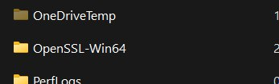

# Лабораторная работа №2*

### Команда  
- Кунгурова Василиса К34201  
- Кормщикова Варвара К34201  

### Задание
Настроить подключение к сервису по HTTPS с помощью самоподписанного сертификата.

### Ход работы

Для начала работы было необходимо установить OpenSSL:



Далее для создания самоподписанного сертификата были созданы privateKey и certificate с помощью следующей команды: 
``` 
openssl req -x509 -nodes -newkey rsa:2048 -keyout privateKey.key -out certificate.crt
```

Ключ ```-x509``` отвечает за то, что создается именно самоподписанный сертификат; 

```newkey``` — автоматическое создание ключа сертификата; 

```days``` — срок действия сертификата в днях; 

```keyout``` — имя файла ключа; 

```out``` — имя файла сертификата.


Была произведена проверка:


На основе сгенерированных ранее сертификата и ключа создадим секрет Kubernetes командой 
```
kubectl create secret tls secret-tls --cert certificate.crt --key privateKey.key
```


Далее установим ingress-addon для minikube с помощью команды ```minikube addons enable ingress```. Ingress – это механизм, который обеспечивает маршрутизацию входящего трафика на уровне приложения.


Теперь необходимо прописать секрет в файле ingress.yaml
```
apiVersion: networking.k8s.io/v1
kind: Ingress
metadata:
  name: ingress
  namespace: default

spec:
  ingressClassName: nginx
  tls:
    - hosts:
      - hell.lab2
      secretName: secret-lab2
  rules:
    - host: "hell.lab2"
      http:
        paths:
          - path: /
            pathType: Prefix
            backend:
              service:
                name: lab2-hell
                port:
                  number: 80
```
Далее этот файл следовало изменить с помощью команды ```kubectl apply -f ingress.yaml```


Внесем изменения в файл hosts - добавим строку соответствия предпочитаемому адресу сервиса IP-адресу 127.0.0.1


Запускаем команду minikube tunnel - ее требуется выполнить для доступности наших ресурсов Ingress по адресу 127.0.0.1.

Можем открыть вкладку в браузере:


Сертификат:


Браузер ругается на самоподписанный сертификат, потому что браузеры доверяют сертификатам, подписанным доверенными Центрами сертификации. А мы сами подписали этот сертификат, поэтому браузер считает его недостоверным.

### Вывод
В результате выполнения данной лабораторной работы было настроено подключение к сервису по HTTPS с помощью самоподписанного сертификата.
