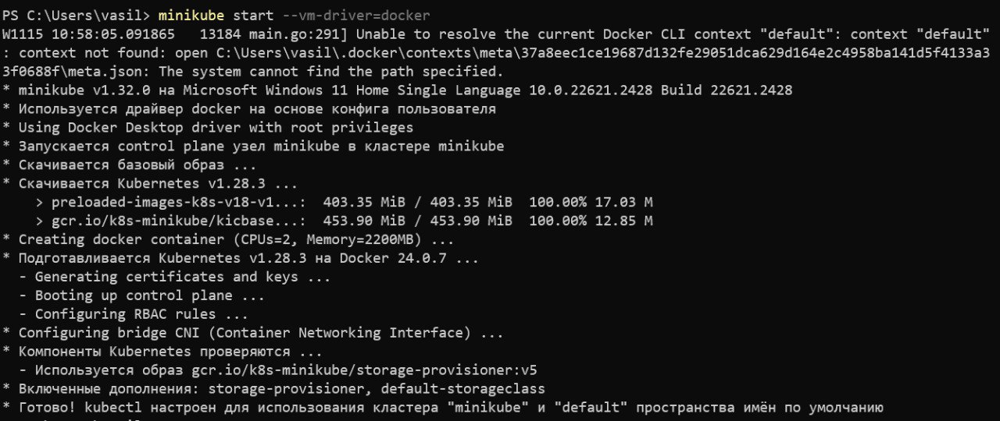
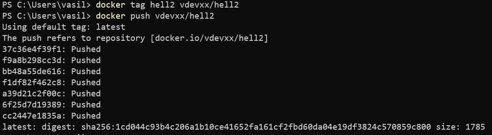
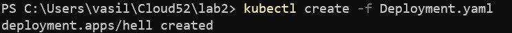
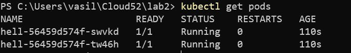
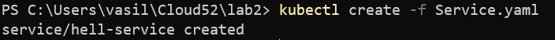
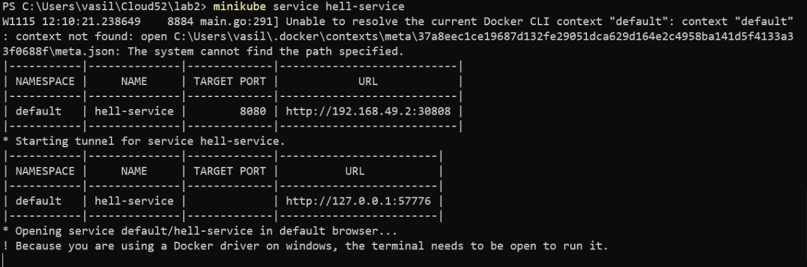
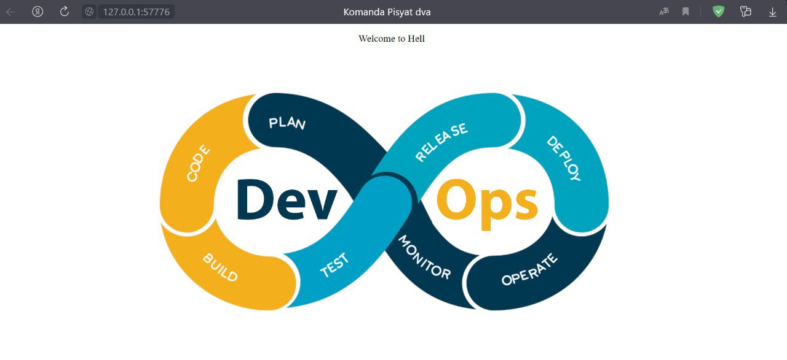

# Лабораторная работа №2

### Команда  
- Кунгурова Василиса К34201  
- Кормщикова Варвара К34201  

### Задание
Поднять kubernetes кластер локально, в нём развернуть свой сервис, используя 2-3 ресурса kubernetes. В идеале разворачивать кодом из yaml файлов одной командой запуска. Показать работоспособность сервиса.

### Ход работы
Для начала нужно установить все необходимые компоненты для работы с Kubernetes:

-**Docker Desktop** был установлен ранее, в нем мы разрешили работу с Kubernetes в разделе настроек.

-**Kubectl** данный компонент необходим для управления кластером

-**Minikube** инструмент для запуска одноузлового кластера Kubernetes на виртуальной машине.

Запустим minikube с помощью команды:
```
minikube start --vm-driver=docker
```



После данного шага был запушен образ из предыдущей лабораторной работы на docker hub



Создадим YAML-файл, в котором опишем Deployment – ресурс Kubernetes, предназначенный для развертывания приложений и их обновления декларативным образом
```
apiVersion: apps/v1
kind: Deployment

metadata:
  name: hell
  labels:
    app: hell

spec:
  selector:
    matchLabels:
      app: hell

  replicas: 2

  template:
    metadata:
      name: hell
      labels:
        app: hell
    spec:
      containers:
        - name: hell
          image: vdevxx/hell2
```
Поясним некоторые заданные в нём параметры.

```kind``` - задаёт вид ресурса Kubernetes, который мы хотим создать. В нашем случае это Deployment.

```spec``` - объект, который описывает нужное состояние ресурса. 

```replicas``` - количество экземпляров, которое будет создано В нашем случае их будет 2.

```image``` - образ нашего контейнера, который мы хотим запустить в данном поде.

```name``` — имя, выбранное для отображения в кластере

```app``` — идентификатор

Для создания ресурса выполнили команду:
```
kubectl create -f Deployment.yaml
```


В нашем кластере запустилось 2 пода:



При вызове отдельных реплик приложения по IP может возникнуть проблема с доступностью подов, поскольку они мигрируют между узлами кластера, а значит, их IP будут меняться. Решить эту проблему можно при помощи service.yaml
```
apiVersion: v1
kind: Service

metadata:
  name: hell-service

spec:
  type: LoadBalancer
  ports:
    - targetPort: 8080
      port: 8080
      nodePort: 30808
  selector:
    app: hell
```
Поясним некоторые фрагменты кода:
```type``` - тип ресурса, указываемый в его спецификации. Мы выбрали тип LoadBalancer, так как с помощью этого сервиса мы хотим решить задачу балансировки нагрузки между подами.

```targetPort``` - порт, на который перенаправляются входящие запросы.

```port``` - порт, по которому сервис принимает запросы.

```nodePort``` — порт, через который служба становится видимой вне кластера Kubernetes по IP-адресу узла и номеру порта, объявленному в этом свойстве.

```selector``` - объект, содержащий сведения о том, с какими подами должен работать сервис.

```app``` - hell: это свойство указывает на то, с какими подами будет работать сервис. А именно — это поды, которым назначена метка app: hell

Для создания ресурса выполним команду:
```
kubectl create -f Service.yaml
```


С помощью следующей команды был получен внешний IP и порт сервиса:
```
minikube service hell-service
```


Проверим работу и запустим наш сервис 



### Вывод
В результате выполнения лабораторной работы были изучены ресурсы Kubernetes и получены навыки развертывания приложений в Kubernetes кластере.


