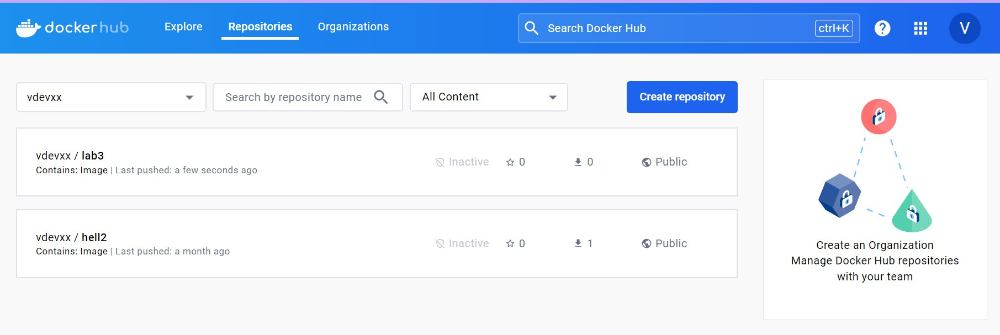

# Лабораторная работа №3

### Команда  
- Кунгурова Василиса К34201  
- Кормщикова Варвара К34201  

### Задание
Сделать, чтобы после пуша в ваш репозиторий автоматически собирался докер образ и результат его сборки сохранялся. 
### Ход работы
В корне репозитория создали папку .github/workflows и внутри этой папки создали файл с именем lab-3.yml
Внизу представлен код файла lab-3.yml.
```
name: Auto Publish Docker Image

on:
  push:
    branches: [ "main" ]
    paths:
      - "lab3/**"
      - ".github/workflows/**"

jobs:
  build-and-push:
    runs-on: ubuntu-22.04

    defaults:
      run:
        working-directory: "/lab3"

    steps:
      - name: check-rep
        uses: actions/checkout@v4

      - name: Log in Docker Hub
        uses: docker/login-action@v3
        with:
          username: ${{ secrets.DOCKERHUB_USERNAME }}
          password: ${{ secrets.DOCKERHUB_TOKEN }}

      - name: docker-build-push
        uses: docker/build-push-action@v5
        with:
          context: "./lab3"
          push: true
          tags: vdevxx/lab3:latest
```
Разберем основные параметры:

```name:``` Название workflow, которое будет отображаться в интерфейсе GitHub Actions.

```on:``` Определяет условия запуска workflow. 

```push:``` Запускаться при каждом пуше в репозиторий. 

```branches:``` [ "main" ]: Только для ветки main. 

```paths:``` Спецификация путей файлов, при изменении которых нужно запускать workflow.

```jobs:``` Определяет задачи, которые будут выполнены в рамках workflow. 

```build-and-push:``` Название задачи. 

```runs-on:``` ubuntu-22.04: Задача будет выполняться на виртуальной машине с операционной системой Ubuntu 22.04.

```working-directory:```  задаем директорию по умолчанию 

```steps:``` Определяет последовательность шагов, которые нужно выполнить в рамках задачи. 

```name:``` check-rep: Название шага. 

```uses:``` actions/checkout@v4: Использует действие для проверки кода из репозитория.

Еще один шаг, который использует действие для входа в Docker Hub. Здесь используются секреты для безопасной передачи логина и токена Docker Hub.

```context:``` "./lab3": Указывает контекст сборки (каталог, в котором находятся файлы для сборки). 

```push: true:``` Говорит о необходимости пушить (публиковать) образ в Docker Hub. 
 
```tags:``` vdevxx/lab3:latest: Указывает тег для образа, который будет опубликован в Docker Hub.

Далее необходимо было настроить Actions secrets and variables, куда мы поместим логин и токен от DockerHub.


Загружаем Dockerfile в репозиторий и ждем завершения Action в GitHub и после успешного завершения можем наблюдать docker-образ в DockerHub



### Вывод
В ходе выполнения лабораторной работы был настроен CI/CD workflow для автоматической сборки и публикации Docker образа при выполнении push в репозиторий. Проведены тесты работоспособности созданного workflow.
