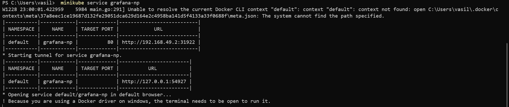

# Лабораторная работа №4

### Команда  
- Кунгурова Василиса К34201  
- Кормщикова Варвара К34201  

### Задание
Сделать мониторинг сервиса, поднятого в кубере (использовать, например, prometheus и grafana). Показать хотя бы два рабочих графика, которые будут отражать состояние системы
### Ход работы
Поставили Chocolatey для установки helm и затем установили Helm -  пакетный менеджер для Kubernetes:

Установили Prometheus:

Откроем Prometheus в браузере:

Получем следующий результат:

Устанавливаем grafana:

При установке нам выпала заметка, что для входа стоит использовать логин admin и пароль, который можно получить, выполнив команду:
```
kubectl get secret --namespace default grafana -o jsonpath="{.data.admin-password}" | base64 --decode ; echo
```
но на Windows base64 не работает, поэтому использовали следующую команду

```
$adminPassword = kubectl get secret --namespace default grafana -o jsonpath="{.data.admin-password}"
$adminPasswordDecoded = [System.Text.Encoding]::UTF8.GetString([System.Convert]::FromBase64String($adminPassword))
echo $adminPasswordDecoded
```
Получили пароль:


Теперь выполним команду ```minikube service grafana-np```


И также откроется интерфейс Grafana:

Войдем с помощью логина admin  и выданного нам пароля:

Создаем соединение с prometheus:

#### Настройка Дашборда
Чтобы создать dashboard, мы перешли на вкладку Dashboards, выбрали создать новый dashboard и далее import. В данном поле можно выбрать готовый шаблон из тех, что представлены на официальном сайте Grafana Labs. Мы выбрали готовый шаблон, указав уникальный ID = 1860.


### Вывод
Был успешно настроен мониторинг сервиса, запущенного в Kubernetes, с использованием Prometheus и Grafana. Было настроено отображение графиков для отслеживания нагрузки
